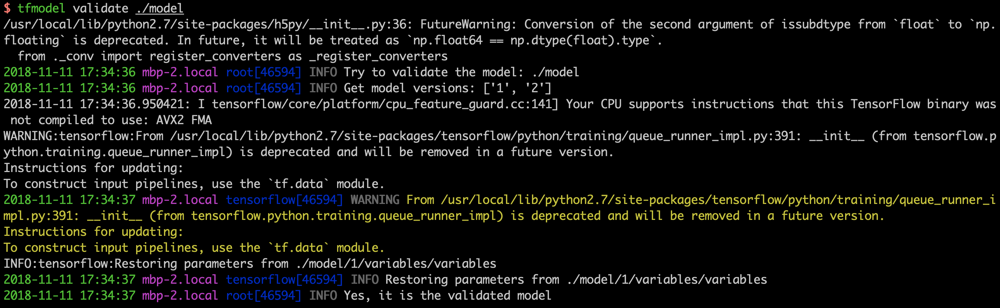
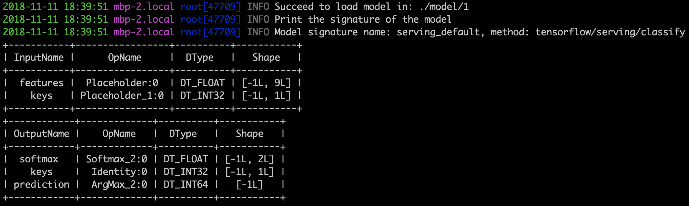
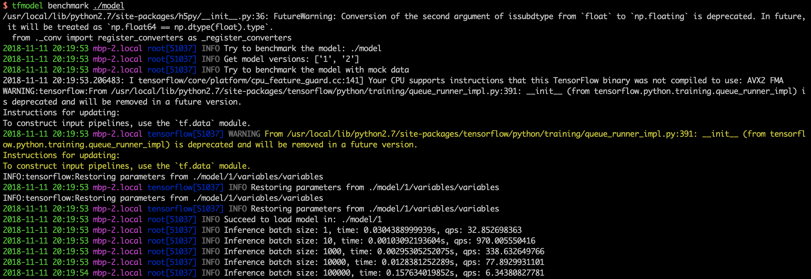
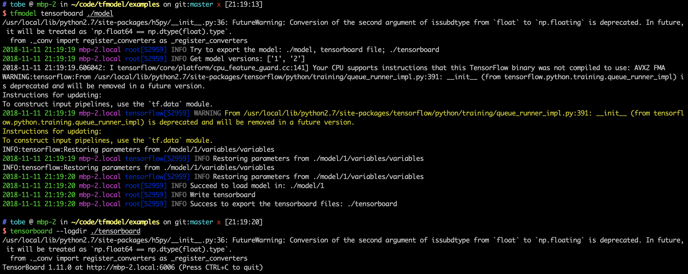

# tfmodel

## Introduction

`tfmodel` is the command-line tool to inspect TensorFlow models for statically and dynamically metrics.

Read more documentation in <https://tfmodel.readthedocs.io>.

## Installation

Install with `pip`.

```bash
pip install tensorflow-model
```

Install with `docker`.

```bash
docker run -it -v /:/host tobegit3hub/tfmodel bash
```

Install from source.

```bash
git clone https://github.com/tobegit3hub/tfmodel

cd ./tfmodel

python ./setup.py install
```

## Usage

### Validate Model

User can validate the model to check if is the deployable TensorFlow SavedModel. 

```bash
tfmodel validate ./model
```



### Inspect Model

User can inspect the model to check the signature before deploying.

```bash
tfmodel inspect ./model
```



### Benchmark Model

User can run benchmark locally and get the performance report with only model files.  

```bash
tfmodel benchmark ./model
```



### TensorBoard Model

User can export the TensorBoard event files without re-training the models.

```bash
tfmodel tensorboard ./model
```

